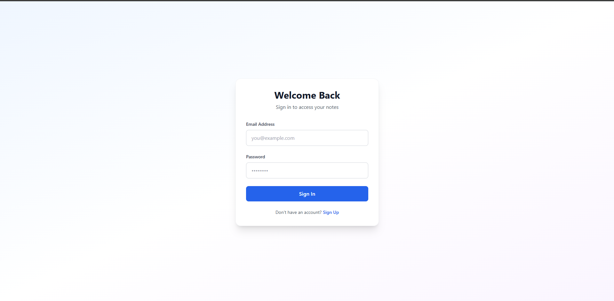
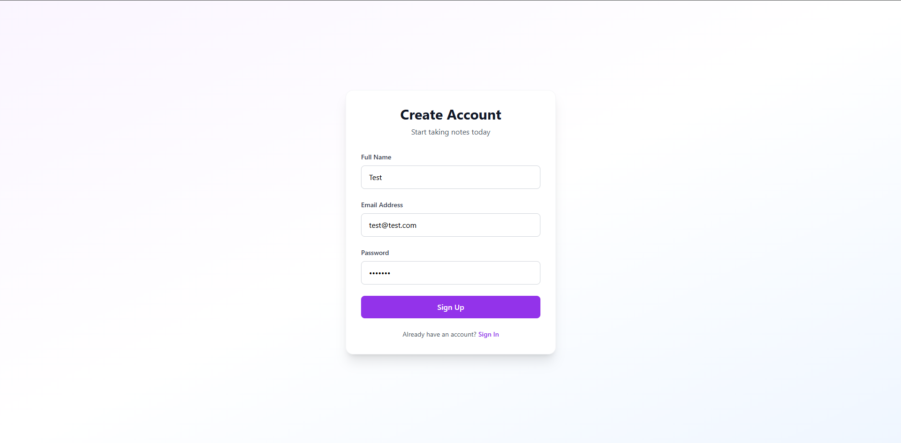
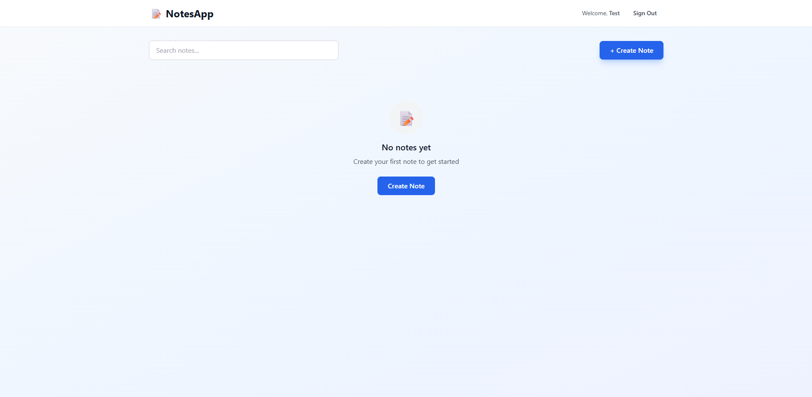
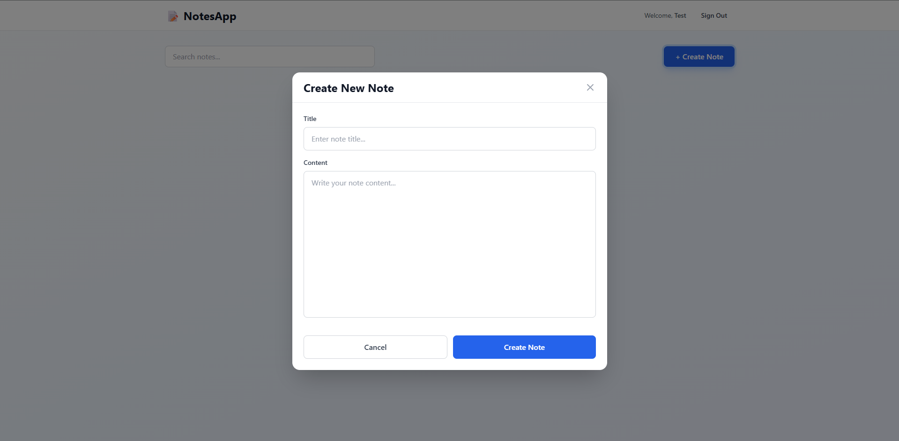
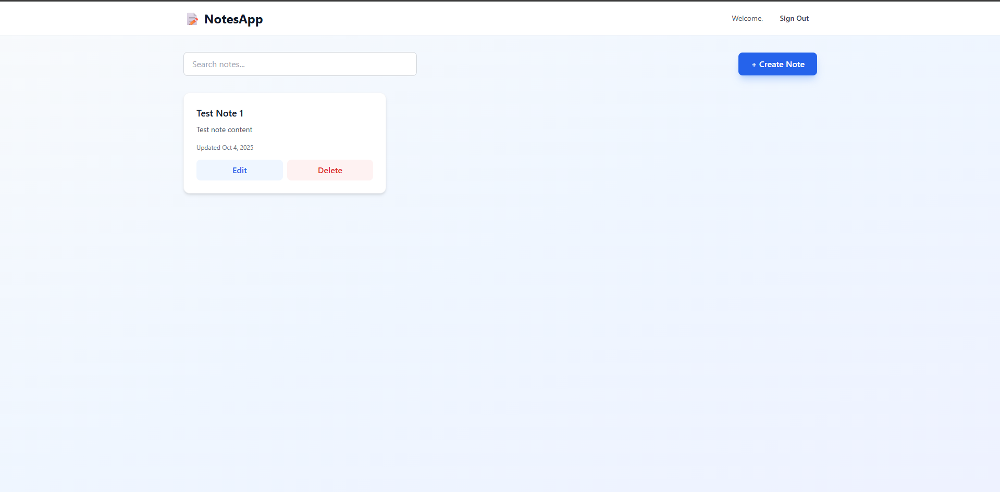
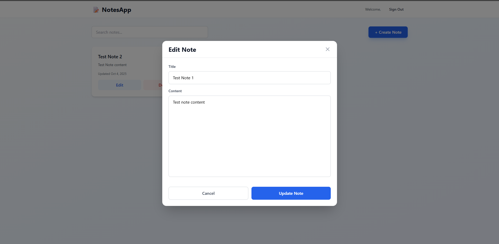
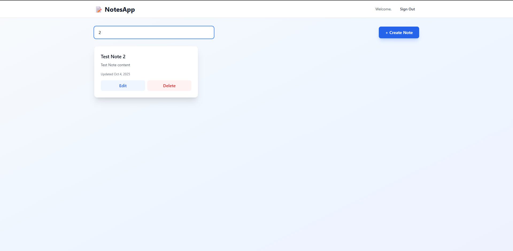
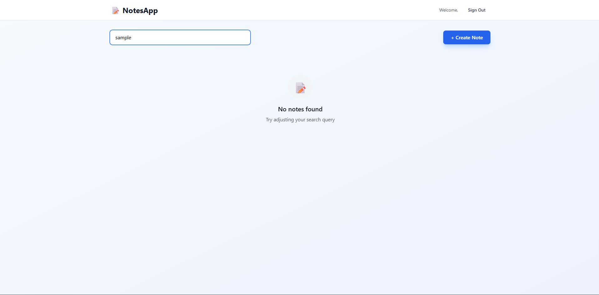

# NotesApp

A modern, full-stack note-taking application built with **Next.js (React, TypeScript, Redux, Tailwind CSS)** for the frontend and **Flask (Python, SQLAlchemy, JWT, MySQL/SQLite)** for the backend.

---

## Table of Contents
- [Features](#features)
- [Architecture](#architecture)
- [Screenshots](#screenshots)
- [Installation](#installation)
  - [Backend Setup (Flask)](#backend-setup-flask)
  - [Frontend Setup (Next.js)](#frontend-setup-nextjs)
- [Usage](#usage)
- [Project Structure](#project-structure)
- [API Endpoints](#api-endpoints)
- [Environment Variables](#environment-variables)
- [License](#license)

---

## Features
- User authentication (Sign up, Sign in, JWT-based)
- Create, edit, delete, and search notes
- Responsive, modern UI with Tailwind CSS
- Notes stored per user
- MySQL (or SQLite fallback) database support
- Secure password hashing
- State management with Redux Toolkit

---

## Architecture
- **Frontend:** Next.js 14, React 18, TypeScript, Redux Toolkit, Tailwind CSS, Framer Motion
- **Backend:** Flask 3, Flask-SQLAlchemy, Flask-CORS, PyJWT, MySQL/SQLite, python-dotenv

---

## Screenshots










---

## Installation

### Backend Setup (Flask)

1. **Install Python 3.9+**
2. Navigate to the `server` directory:
   ```sh
   cd server
   ```
3. (Optional) Create a virtual environment:
   ```sh
   python -m venv venv
   venv\Scripts\activate  # On Windows
   # or
   source venv/bin/activate  # On Mac/Linux
   ```
4. **Install dependencies:**
   ```sh
   pip install -r requirements.txt
   ```
5. **Configure environment variables:**
   - Create a `.env` file in `server/` (see [Environment Variables](#environment-variables))
6. **Run the backend server:**
   ```sh
   python app.py
   ```
   - The server runs on [http://localhost:5000](http://localhost:5000)

### Frontend Setup (Next.js)

1. Navigate to the `client` directory:
   ```sh
   cd client
   ```
2. **Install dependencies:**
   ```sh
   npm install
   ```
3. **Configure environment variables:**
   - Create a `.env.local` file in `client/` (see [Environment Variables](#environment-variables))
4. **Run the frontend app:**
   ```sh
   npm run dev
   ```
   - The app runs on [http://localhost:3000](http://localhost:3000)

---

## Usage
- Open [http://localhost:3000](http://localhost:3000) in your browser.
- Sign up for a new account, sign in, and start creating notes!

---

## Project Structure
```
version_1/
├── client/         # Next.js frontend
│   ├── src/
│   │   ├── app/            # App routes (Next.js 14)
│   │   ├── components/     # React components
│   │   ├── redux/          # Redux Toolkit store & slices
│   │   └── store/          # Custom hooks for state
│   ├── public/
│   ├── package.json
│   └── ...
├── server/         # Flask backend
│   ├── app.py
│   ├── requirements.txt
│   └── ...
```

---

## API Endpoints

### Auth
- `POST   /api/auth/signup`   — Register new user
- `POST   /api/auth/signin`   — Login, returns JWT
- `GET    /api/auth/me`       — Get current user info (JWT required)

### Notes
- `GET    /api/notes`         — List all notes (JWT required)
- `GET    /api/notes/<id>`    — Get a single note (JWT required)
- `POST   /api/notes`         — Create a note (JWT required)
- `PUT    /api/notes/<id>`    — Update a note (JWT required)
- `DELETE /api/notes/<id>`    — Delete a note (JWT required)

### Health
- `GET    /api/health`        — Health check

---

## Environment Variables

### Backend (`server/.env`)
```
SECRET_KEY=your_secret_key
DATABASE_HOST=localhost
DATABASE_USER=root
DATABASE_PASSWORD=yourpassword
DATABASE_PORT=3306
DATABASE_NAME=notes_db
```

### Frontend (`client/.env.local`)
```
NEXT_PUBLIC_API_URL=http://localhost:5000
```

---
